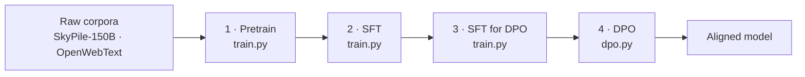

<div align="center">

# vocab_32k_gpt2

**A compact, end-to-end recipe for training a GPT-2 class language model from scratch — pretraining, supervised fine-tuning, and preference alignment.**

[](https://www.python.org/)
[](https://pytorch.org/)
[](https://github.com/huggingface/transformers)
[](https://github.com/microsoft/DeepSpeed)
[](LICENSE)

</div>

---

## Overview

`vocab_32k_gpt2` is a GPT-2 architecture (≈110M parameters, weight-tied) paired with a custom
32K SentencePiece vocabulary, trained from random initialisation through the full modern
alignment pipeline. It is deliberately small: every stage fits on a handful of consumer or
workstation GPUs, which makes it a practical reference for understanding how a production
LLM pipeline is wired together end to end.



| Stage | Entrypoint | Config | Output |
| :--- | :--- | :--- | :--- |
| 1 · Pretrain | `train.py` | `configs/pretrain_config.yaml` | `ckpt/vocab_32k_gpt2` |
| 2 · SFT | `train.py` | `configs/instruct_config.yaml` | `ckpt/vocab_32k_gpt2_instruction` |
| 3 · SFT for DPO | `train.py` | `configs/dpo_instruct_config.yaml` | `ckpt/vocab_32k_gpt2_sft4dpo` |
| 4 · DPO | `dpo.py` | CLI flags (`ScriptArguments`) | `ckpt/vocab_32k_gpt2_dpo` |

### Highlights

- **One entrypoint for pretraining and SFT.** `train.py` switches behaviour on `data.mode`,
  so both stages share the same dataloader, optimizer, scheduler and checkpoint logic.
- **Streaming data pipeline.** Corpora are consumed lazily via `datasets` iterable datasets
  and sharded across ranks, so dataset size is bounded by disk, not by RAM.
- **Sequence packing.** Documents can be sampled, split or concatenated into full-length
  sequences, which removes nearly all padding waste during pretraining.
- **Prompt masking for SFT.** Instruction tokens are set to `-100` so the loss is computed on
  responses only, including for multi-turn conversations.
- **Distributed by default.** `accelerate` + DeepSpeed ZeRO stages 1/2/3 (with optional CPU
  offload), bf16 mixed precision, gradient checkpointing and optional LoRA adapters.
- **Resumable.** Training state is checkpointed periodically and the dataloader is
  fast-forwarded on restart so batches are not replayed.

---

## Quickstart

### 1. Environment

Requires Python 3.10+, a CUDA 11.8+ toolchain matching your PyTorch build, and Linux or WSL2
(the launch scripts are Bash).

```bash
python -m venv .venv && source .venv/bin/activate
pip install torch --index-url https://download.pytorch.org/whl/cu118
pip install -r requirements.txt
```

### 2. Verify the tokenizer

```bash
python utils/spm_to_hf_tokenizer.py --vocab_file configs/tokenizer_models/vocab_32k_gpt2.model
```

This prints the vocabulary size and special-token ids, then checks that a few bilingual
probes round-trip through encode/decode.

### 3. Prepare data

Place JSONL shards under `data/` and point the `data.data` section of a config at them. See
[Data formats](#data-formats) for the expected schema of each stage.

### 4. Train

```bash
bash scripts/launch/pre_train.sh    # 1 · pretrain
bash scripts/launch/sft.sh          # 2 · supervised fine-tuning
bash scripts/launch/sft4dpo.sh      # 3 · SFT on the preference prompts
bash scripts/launch/dpo.sh          # 4 · DPO
```

Every launch script reads its settings from the environment, so a run can be retargeted
without editing files:

```bash
CUDA_VISIBLE_DEVICES=0,1 \
ACCELERATE_CONFIG=configs/accelerate_configs/ds_stage3.yaml \
  bash scripts/launch/pre_train.sh
```

### 5. Sample from a checkpoint

```bash
python scripts/eval/generate.py --checkpoint ckpt/vocab_32k_gpt2
python scripts/eval/generate.py \
  --checkpoint ckpt/vocab_32k_gpt2_instruction/checkpoint_epoch4 --prompt_set sft
```

---

## Model and tokenizer

The model is a standard GPT-2 decoder re-exported under a project-local class name so that
checkpoints stay self-describing.

| Property | Value |
| :--- | :--- |
| Layers / heads / hidden size | 12 / 12 / 768 |
| Context length | 1024 |
| Vocabulary | 32,000 (SentencePiece) |
| Parameters | ≈110M, `lm_head` tied to `wte` |
| Activation | `gelu_new` |
| `bos` / `eos` / `pad` token ids | 1 / 2 / 3 |

- Tokenizer model: `configs/tokenizer_models/vocab_32k_gpt2.model`
- Architecture overrides: `configs/model_configs/vocab_32k_gpt2.json`
- Defaults live in `models/configuration_vocab_32k_gpt2.py`

The tokenizer is instantiated with `legacy=False`, which disables SentencePiece's dummy
prefix so that a leading space is never silently inserted. `vocab_size` and `pad_token_id`
are overwritten from the loaded tokenizer at startup, so the tokenizer file is the single
source of truth.

---

## Data formats

All stages read newline-delimited JSON. The `data.data` block maps an arbitrary source name
to a glob pattern; every match is shuffled into one stream, so mixing corpora is a matter of
adding entries.

```yaml
data:
  data:
    sky-pile150B: "data/SkyPile-150B/rawdata/2020-40_zh_*.jsonl"
    openwebtext: "data/openwebtext/openwebtext.jsonl"
```

### Pretraining (`mode: pretrain`)

One document per line, under a `text` key:

```json
{"text": "Sequence modelling with transformers begins with ..."}
```

Corpora that store content under different keys need a branch in `pretrain_transform`
(`dataset/dataset.py`); the archived `dataset/legacy/sft_dataset.py` contains worked examples
for title/body corpora.

### Instruction tuning (`mode: instruct`)

`instruction` and `output` are required; `input` and `history` may be empty. `history` holds
`[user, assistant]` pairs and is expanded into one training example per turn.

```json
{"instruction": "Explain gradient accumulation.", "input": "", "output": "It splits a large batch ...", "history": []}
{"instruction": "And for ZeRO-3?", "input": "", "output": "Parameters are sharded ...", "history": [["Explain gradient accumulation.", "It splits a large batch ..."]]}
```

Examples are rendered with the project template and only the response contributes to the
loss:

```text
### Instruction:
{instruction}

### Input:          # omitted when `input` is empty
{input}

### System:
{output}</s>
```

### Preference data (DPO)

`response_j` is the preferred completion, `response_k` the rejected one:

```json
{"question": "How should I start learning deep learning?", "response_j": "Begin with linear algebra and Python ...", "response_k": "No idea."}
```

---

## Configuration reference

### Data section

| Key | Description |
| :--- | :--- |
| `mode` | `pretrain` or `instruct`; selects the normalisation branch. |
| `data` | Mapping of source name to glob pattern. |
| `seq_length` | Tokens per training sequence. |
| `tokenizer_model_path` | Path to the SentencePiece model. |
| `pad_to_max` | Pad every example to `seq_length` at tokenisation time. |
| `sequence_sample_mode` | `truncation`, `none`, `sample` (random crop) or `split` (consecutive chunks). |
| `concat_multiple_sequence` | Pack several documents into full-length sequences. |
| `num_sequences` | Documents fused per packed batch when packing is enabled. |
| `split_by_shard` | Truncate the shard list to a multiple of the world size so ranks split by file. |

### Train section

| Key | Description |
| :--- | :--- |
| `train_batch_size` | Micro-batch size **per process**. |
| `gradient_accumulation_steps` | Micro-batches per optimizer step. Keep in sync with the accelerate config. |
| `num_training_steps` | Cap on micro-batches consumed per process; also scales the cosine schedule. |
| `num_warmup_steps` | Linear warmup length. |
| `lr` / `weight_decay` | FusedAdam hyperparameters (`betas=(0.9, 0.95)`); biases and norms are excluded from decay. |
| `ckpt` | Hugging Face checkpoint to initialise from, or empty to train from scratch. |
| `train_num_workers_4_dataloader` / `prefetch_factor` | Dataloader throughput knobs. |
| `train_and_eval` | Sample from the validation prompts during training. |
| `gradient_checkpointing_enable` | Trade compute for activation memory. |
| `use_lora` | Attach LoRA adapters (`r=1`, `alpha=32`) to `q_proj`/`v_proj`. |

### Run section

| Key | Description |
| :--- | :--- |
| `log_interval` / `eval_interval` / `save_interval` | Intervals in optimizer steps. |
| `work_dir` | Directory for checkpoints and resume state. |
| `project_name` | Weights & Biases project name. |

> **Effective batch size** = `train_batch_size` × `gradient_accumulation_steps` × number of
> processes. `gradient_accumulation_steps` appears in both the training config and
> `configs/accelerate_configs/ds_stage2.yaml`; a mismatch silently changes the schedule.

### Distributed configs

| File | ZeRO stage | Notes |
| :--- | :--- | :--- |
| `ds_stage1.yaml` | 1 | Optimizer state sharding. |
| `ds_stage2.yaml` | 2 | Default for all launch scripts; also shards gradients. |
| `ds_stage3.yaml` | 3 | Parameter sharding; use when weights no longer fit. |
| `ds_stage3_offload.yaml` | 3 + CPU offload | Last resort for tight VRAM budgets. |
| `default_config.yaml` | 1 | Plain 8-process baseline, no per-run port pinning. |

All configs use bf16. Set `num_processes` to match the number of visible devices, and give
concurrent runs distinct `main_process_port` values.

---

## Checkpointing, logging and evaluation

**Checkpointing.** `Trainer` calls `accelerator.save_state` every `save_interval` optimizer
steps, writing to `work_dir/checkpoint_epoch{N}`. On startup it calls
`accelerator.load_state(work_dir)`; if state is found, the global step is recovered from the
scheduler and the dataloader is fast-forwarded past the batches already consumed.

> **Caveat:** saves land in `work_dir/checkpoint_epoch{N}` while the resume path reads
> `work_dir` itself. To resume from a specific checkpoint, point `work_dir` at that
> subdirectory (or copy its contents one level up). A missing checkpoint is not an error —
> training simply starts from scratch, so check the startup log line before assuming a run
> resumed.

**Logging.** Metrics (loss, learning rate, loss scale, tokens/second/GPU, step and epoch
counters) go to Weights & Biases from the main process only. `WANDB_MODE` defaults to
`offline` so training never blocks on network access; export `WANDB_MODE=online` together
with your own `WANDB_API_KEY` to stream results.

**Evaluation.** `scripts/eval/generate.py` samples completions for the probe prompts in
`dataset/validation.py`. Use `--prompt_set pretrain` for raw continuations and
`--prompt_set sft` for prompts pre-rendered with the instruction template. Decoding can be
tuned with `--greedy`, `--temperature`, `--top_p`, `--repetition_penalty` and
`--max_new_tokens`. Pass `--from_zero_checkpoint` to consolidate a DeepSpeed ZeRO state
directory into fp32 weights before sampling.

---

## Repository layout

```text
.
├── train.py                          # Pretraining / SFT entrypoint (mode-driven)
├── trainer.py                        # Training loop, logging, checkpointing, resume
├── dpo.py                            # DPO training via TRL's DPOTrainer
├── requirements.txt
├── pyproject.toml                    # Ruff / Black configuration
├── configs/
│   ├── pretrain_config.yaml
│   ├── instruct_config.yaml
│   ├── dpo_instruct_config.yaml
│   ├── model_configs/                # Architecture overrides
│   ├── tokenizer_models/             # SentencePiece model and vocabulary
│   └── accelerate_configs/           # Accelerate + DeepSpeed ZeRO presets
├── dataset/
│   ├── dataset.py                    # Streaming pipeline for both training modes
│   ├── data_iter.py                  # Standalone sharded JSONL reader
│   ├── validation.py                 # Fixed probe prompts
│   └── legacy/                       # Archived, non-streaming ancestor
├── models/
│   ├── configuration_vocab_32k_gpt2.py
│   ├── modeling_vocab_32k_gpt2.py
│   └── tokenization_vocab_32k_gpt2.py
├── scripts/
│   ├── launch/                       # pre_train.sh · sft.sh · sft4dpo.sh · dpo.sh
│   └── eval/generate.py              # Sampling / smoke-test CLI
├── utils/
│   └── spm_to_hf_tokenizer.py        # Tokenizer verification and HF export
└── docs/
    └── STRUCTURE.md                  # Layout conventions and operating rules
```

---

## Troubleshooting

| Symptom | Likely cause and fix |
| :--- | :--- |
| `AssertionError: No files matched the data pattern` | A glob in `data.data` matches nothing. Patterns are resolved relative to the repository root. |
| CUDA out of memory | Lower `train_batch_size`, raise `gradient_accumulation_steps`, enable `gradient_checkpointing_enable`, or move to `ds_stage3.yaml` / `ds_stage3_offload.yaml`. |
| Training restarts from step 0 unexpectedly | `work_dir` contains no resumable state; see the checkpointing caveat above. |
| `ValueError: Unrecognised pretraining record` | The corpus does not expose a `text` field. Add a branch to `pretrain_transform`. |
| Loss ignores most of an SFT example | Expected: prompt tokens are masked to `-100`, so only the response contributes. |
| ZeRO-3 saves less memory than expected | Parameter partitioning only applies to models built inside `deepspeed.zero.Init()`, which the `Auto*` classes enter automatically. `train.py` instantiates the model class directly, so register the architecture with `AutoModelForCausalLM` first. See [accelerate#932](https://github.com/huggingface/accelerate/pull/932). |
| Port already in use during launch | Two runs share `main_process_port`. Change it in the accelerate config. |
| Throughput collapses on a multi-node host | Try the commented `NCCL_*` overrides at the top of the launch scripts. |

---

## Reproducibility

- Seeds are fixed at 42 for data shuffling (`dataset/dataset.py`) and DPO (`--seed`).
- Archive the exact `configs/*.yaml` used for each run alongside its checkpoint.
- Record GPU model and count, VRAM, CUDA version and the resolved package versions
  (`pip freeze`); `accelerate`/`deepspeed` are pinned in `requirements.txt` because their
  checkpoint formats have historically shifted between releases.
- Streaming shuffles depend on shard order and world size, so exact batch-level
  reproducibility requires an identical device count.

---

## Acknowledgements

The training loop and data pipeline started from [Open-Llama](https://github.com/Bayes-Song/Open-Llama);
the model, configuration and tokenizer classes are adapted from
[Hugging Face Transformers](https://github.com/huggingface/transformers) (GPT-2, LLaMA and
T5 tokenization). Distributed training builds on
[Accelerate](https://github.com/huggingface/accelerate),
[DeepSpeed](https://github.com/microsoft/DeepSpeed),
[Datasets](https://github.com/huggingface/datasets) and
[TRL](https://github.com/huggingface/trl).

Originally developed as an undergraduate capstone project.

## License

Released under the [Apache License 2.0](LICENSE).
